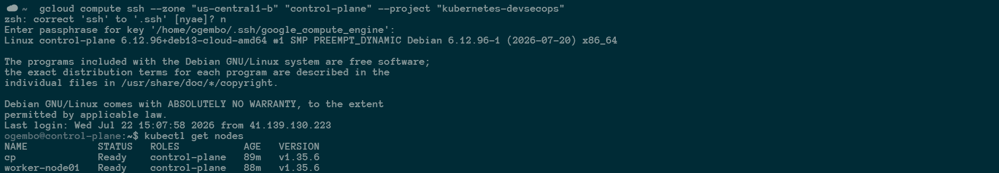
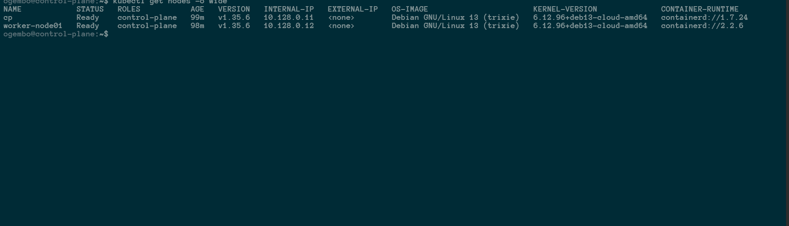
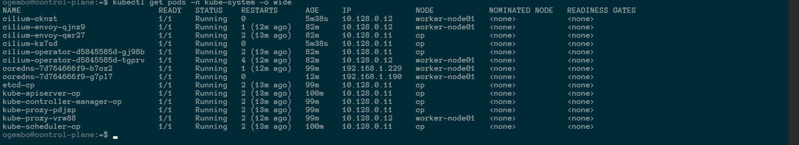
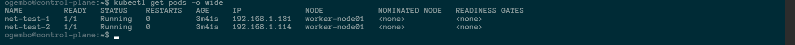
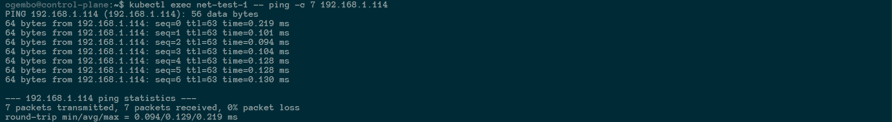

# Today on Kubernetes: From `kubeadm init` to eBPF

Setting up a Kubernetes cluster from scratch is a rite of passage. For this entry in my **Today on Kubernetes** series, I spun up a Kubernetes `v1.35.6` cluster on Google Cloud Platform using Debian 13 and containerd.

The goal was straightforward: go from a raw `kubeadm init` to a fully functioning cluster with Cilium providing pod networking through eBPF. The path there was less straightforward—and that is where the useful lessons were.

This is a practical walkthrough of the errors I hit, how I traced them, and the payoff: two Alpine test pods communicating with **0% packet loss**.



## Step 0: Start with the prerequisites

From an empty Linux VM, you need a container runtime—containerd in my case—and the Kubernetes binaries: `kubelet`, `kubeadm`, and `kubectl`.

I used the [official kubeadm cluster-creation guide](https://kubernetes.io/docs/setup/production-environment/tools/kubeadm/create-cluster-kubeadm/) for the installation steps. Once the runtime and binaries were ready, I initialized the control plane:

```bash
sudo kubeadm init
```

At the end of the command, kubeadm prints a `kubeadm join` command. Run that command on each worker node to connect it to the control plane.

## Step 1: Apply Cilium from the right node

With the nodes registered, I applied the Cilium CNI manifest. Without a CNI, nodes remain `NotReady` and pods cannot get network interfaces.

My first attempt failed:

```text
root@worker-node01:~# kubectl apply -f ~/SOLUTIONS/s_03/cilium-cni.yaml
error: error validating data: failed to download openapi: Get "http://localhost:8080/openapi/v2": dial tcp [::1]:8080: connect: connection refused
```

### The mistake: the localhost trap

I was logged into `worker-node01`. Worker nodes do not run the API server and do not automatically have the administrative kubeconfig. Without a usable kubeconfig, `kubectl` falls back to `localhost:8080` and fails.

### The fix: context matters

I returned to the control-plane node, configured `~/.kube/config` from `/etc/kubernetes/admin.conf`, and applied the manifest there. The command then reached the API server successfully.

## Step 2: Schedule test workloads

To test connectivity, I created two Alpine Linux pods:

```bash
kubectl get pods -o wide
```

```text
NAME         READY   STATUS    RESTARTS   AGE   IP       NODE
net-test-1   0/1     Pending   0          63m   <none>   <none>
net-test-2   0/1     Pending   0          63m   <none>   <none>
```

### The mistake: ignoring control-plane taints

`kubectl describe pod net-test-1` showed that the scheduler could not find a suitable node. The control plane had its standard `NoSchedule` taint, and the worker was still initializing after a reboot.

### The fix: untaint a lab cluster

For a single-node or lab environment, removing the taint is a quick way to allow workloads to run anywhere:

```bash
kubectl taint nodes cp node-role.kubernetes.io/control-plane:NoSchedule- --all
```

The pods moved from `Pending` to `ContainerCreating` immediately.

## Step 3: Fix the CNI plugin path

The pods then stayed in `ContainerCreating`. The Events section of `kubectl describe pod net-test-1` showed the real issue:

```text
Failed to create pod sandbox: rpc error: ... failed to find plugin "cilium-cni" in path [/usr/lib/cni]
```

### The mistake: misaligned directories

Kubelet was looking for CNI binaries in `/usr/lib/cni`, while Cilium had placed them in `/opt/cni/bin`. Kubelet could not find the plugin needed to attach the pod network interface.

### The fix: bridge the paths

In this lab environment, I created the expected directory, linked the binaries, and restarted kubelet:

```bash
sudo mkdir -p /usr/lib/cni
sudo ln -sf /opt/cni/bin/* /usr/lib/cni/
sudo systemctl restart kubelet
```

## Step 4: Correct the `kubectl run` syntax

The path fix worked. Cilium assigned IP addresses, but the pods crashed with `RunContainerError`.

The problem was a small typo in the imperative command. This version has an extra space after the first `--`:

```bash
kubectl run net-test-1 --image=alpine -- restart=Never -- sleep 3600
```

That made Kubernetes pass `restart=Never` to Alpine's entrypoint. Alpine did not understand it and exited.

I deleted the failed pods and recreated them with the correct syntax:

```bash
kubectl delete pod net-test-1 net-test-2
kubectl run net-test-1 --image=alpine --restart=Never -- sleep 3600
kubectl run net-test-2 --image=alpine --restart=Never -- sleep 3600
```

## The payoff: a working eBPF network

With the command syntax corrected, the CNI path fixed, and the nodes untainted, the cluster came together.

The nodes were `Ready`:



Cilium's eBPF stack and CoreDNS were running cleanly in `kube-system`:



The test workloads received overlay IPs from Cilium:



Finally, I ran an ICMP ping from `net-test-1` to `net-test-2`:



```text
7 packets transmitted, 7 packets received, 0% packet loss
```

That final result is the part worth remembering. Troubleshooting Kubernetes is mostly about reading the evidence: check the current context, inspect scheduling events, follow the runtime errors, and trace the path between the component that is looking for something and the component that provides it.

That is how `kubeadm init` becomes a working cluster.
