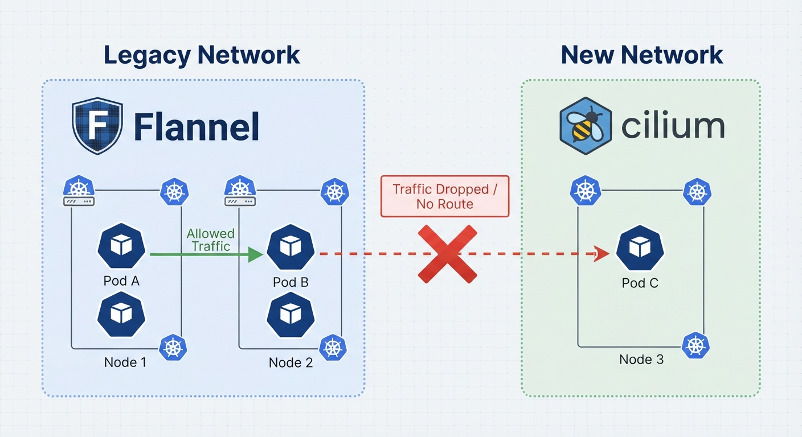
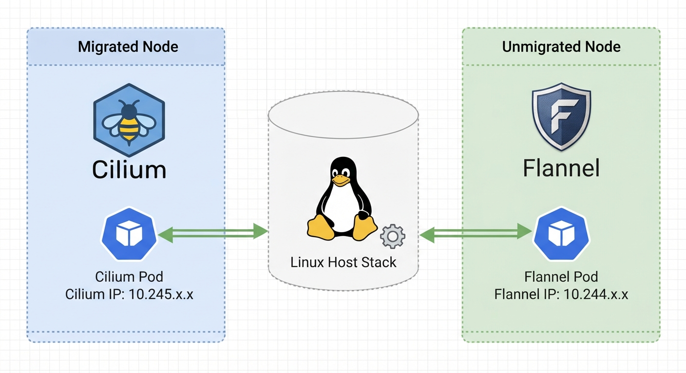
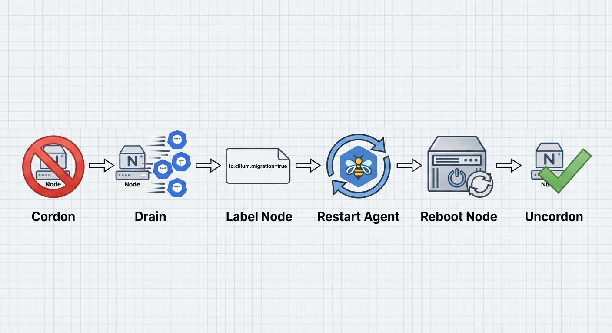

# Today on Kubernetes: How to Migrate Live Kubernetes Clusters from Flannel to Cilium Node-by-Node

When you first spin up a Kubernetes cluster, your primary goal is simple: get your pods talking to each other. For this, Flannel is often the undisputed champion. It is incredibly lightweight, requires almost zero configuration, and "just works." If you are building a home lab, a local cluster with kubeadm, or a proof-of-concept environment, Flannel is the perfect CNI (Container Network Interface) to get you off the ground quickly.

But as your cluster matures and moves toward production, your networking requirements change. You realize you need strict security boundaries, but Flannel natively lacks support for standard Kubernetes NetworkPolicies, meaning you can't easily firewall traffic between different namespaces or workloads. Furthermore, as traffic scales, you might find yourself needing advanced load balancing, deep layer-7 observability, and the massive CPU and routing performance gains offered by eBPF.

That is exactly the point when a migration to a feature-rich, eBPF-powered CNI like Cilium becomes necessary.

Migrating a CNI on a live Kubernetes cluster, however, can feel like performing open-heart surgery while the patient is running a marathon. Standard approaches often require painful downtime or complex setups with multi-CNI tools like Multus.

In this guide, I'll walk through a hands-on approach to safely executing a live, rolling migration from Flannel to Cilium. Using Cilium's CiliumNodeConfig CRD, we can migrate a cluster node by node without disrupting existing pod-to-pod communication.

*Acknowledgments & Inspiration: The core technical mechanism and operational commands in this guide are adapted from the excellent **[Isovalent "Migrating from Flannel" Hands-on Lab](https://isovalent.com/labs/cilium-migrating-from-flannel/)**. I have adapted their sandbox concepts into a real-world architectural walkthrough, complete with custom validation tests that you can run on your own cloud instances (like GCP or AWS) to prove the networking holds up.*

## The Challenge: CNI Migration Patterns

When moving from a legacy CNI to a modern one, you generally have a few options, most of which have significant drawbacks. Choosing the right one depends entirely on your uptime SLA.

**A GitOps Rebuild (The Cleanest, but Hardest):** Build a brand new cluster with Cilium and migrate workloads using a GitOps controller like ArgoCD.  
When to use it: If your applications are entirely stateless, easily reprovisioned, and you have robust DNS cutover strategies.  
The drawback: It involves massive prep work and potential stateful data headaches.

**The "Rip and Replace" (The Outage Approach):** Reconfigure /etc/cni/net.d/ to point to the new CNI.  
When to use it: For non-production clusters where you don't care about downtime.  
The drawback: Existing Pods are still wired to the old CNI. You must recycle every single pod in the cluster simultaneously, resulting in a significant cluster-wide outage.

**A Rolling Restart (The "Island" Problem):** You configure all nodes with the new CNI and gradually restart them node-by-node.  
When to use it: Almost never, unless you are using the dual-overlay method we will cover below.  
The drawback: Without dual-overlay configuration, unmigrated nodes and migrated nodes get split into two "islands" of connectivity. Why? Because existing pods remain on the legacy 10.244.x.x CIDR and lack routing rules to reach the new 10.245.x.x pods on migrated nodes. Traffic drops into a black hole until the entire cluster migration finishes.



## The Solution: Live Migration via Dual Overlays

To avoid downtime and split-brain networking, we can use a hybrid dual-overlay model.

While a Pod on a given node is only attached to one network (either Flannel or Cilium), it has full access to both Cilium and non-Cilium pods while the migration is taking place.

How does this work? By installing Cilium with a separate CIDR range and encapsulation port than Flannel, the standard Linux routing table takes care of seamlessly separating and routing the traffic. CiliumNodeConfig allows us to selectively apply this new configuration on a node-by-node basis, allowing for a highly controlled rollout.



## Prerequisites & Assumptions

Before executing this in your own environment, ensure you have the following:

- **Cluster Admin RBAC:** You need permissions to deploy DaemonSets, modify nodes, and alter kube-system resources.
- **Helm Installed:** We will use Helm to template and deploy the Cilium manifests.
- **A Distinct Cluster CIDR:** Flannel usually uses 10.244.0.0/16. We will configure Cilium to use a completely separate range: 10.245.0.0/16.
- **Cluster Pool IPAM:** We must instruct Cilium to use the cluster-pool IPAM mode. This is critical because it tells Cilium to manage per-node PodCIDRs independently of the underlying cloud provider's network, ensuring clear separation from Flannel's IPAM.
- **Scale Considerations:** This guide assumes a small-to-medium cluster. If you have a massive, multi-AZ cluster, you will need to script this process to batch nodes (e.g., migrating 5-10 nodes at a time per AZ) to maintain quorum and application availability.

## Step 1: Deploying the Test Application & Preparing Cilium

First, let's deploy our test application. We'll name it `payment-api` to frame it as a real production workload, but use `traefik/whoami`, a tiny web server that replies with its own IP address and headers. This is the perfect tool for validating that cross-CNI routing works — we can visually confirm new pods get Cilium IPs while old ones retain their Flannel assignments, and that they can still communicate.

```bash
kubectl create deployment payment-api --image=traefik/whoami --replicas=10
```

Let's check their IPs. Notice they are all on the legacy 10.244.x.x Flannel network:

```bash
kubectl get pods -l app=payment-api -o wide
```

**Expected Output:**
```
NAME                           READY   STATUS    IP           NODE
payment-api-5c9c9...           1/1     Running   10.244.1.5   worker-1
payment-api-5c9c9...           1/1     Running   10.244.2.3   worker-2
...
```

### Installing Cilium in "Secondary" Mode

Next, we install Cilium, but we explicitly tell it not to take over CNI duties yet. We do this by changing the CIDR (10.245.0.0/16), changing the VXLAN port (8473), routing legacy traffic through the host stack, and setting `cni.customConf=true`.

```bash
helm install cilium cilium/cilium --namespace kube-system \
  --set operator.unmanagedPodWatcher.restart=false \
  --set cni.customConf=true \
  --set cni.uninstall=false \
  --set ipam.mode="cluster-pool" \
  --set ipam.operator.clusterPoolIPv4PodCIDRList="10.245.0.0/16" \
  --set policyEnforcementMode="never" \
  --set bpf.hostLegacyRouting=true \
  --set tunnelPort=8473
```

Now, we create our CiliumNodeConfig. This CRD tells Cilium to write its CNI configuration only to nodes that have a specific label (`io.cilium.migration/cilium-default: "true"`).

```yaml
# Save as migration-config.yaml and apply via kubectl
apiVersion: cilium.io/v2
kind: CiliumNodeConfig
metadata:
  namespace: kube-system
  name: cilium-default
spec:
  nodeSelector:
    matchLabels:
      io.cilium.migration/cilium-default: "true"
  defaults:
    write-cni-conf-when-ready: /host/etc/cni/net.d/05-cilium.conflist
  custom-cni-conf: "false"
  cni-chaining-mode: "none"
  cni-exclusive: "true"
```

Wait, is that a contradiction?

You might notice we passed `--set cni.customConf=true` in Helm, but the CRD says `custom-cni-conf: "false"`. This is intentional! The global Helm value tells the Cilium operator not to generate the CNI config cluster-wide. The CRD overrides this locally for specific nodes, triggering the Cilium agent on that exact node to write the `05-cilium.conflist` file and take over.

## Step 2: The Node-by-Node Migration

To safely migrate a node without disrupting user traffic, we follow a strict operational workflow. Note: You should perform this serially (one node at a time) for smaller clusters, monitoring application health between each node.



Let's migrate our first worker node.

### 1. Cordon and Drain:

We safely evict our workloads to other nodes in the cluster. We pass `--ignore-daemonsets` because DaemonSets (like kube-proxy and Flannel itself) must keep running to maintain node health during the transition.

```bash
NODE="worker-1"
kubectl cordon $NODE
kubectl drain $NODE --ignore-daemonsets
```

(Depending on your pod disruption budgets and grace periods, a drain usually takes 1-3 minutes).

### 2. Label the Node and Restart Cilium:

Applying the label triggers the CiliumNodeConfig we created earlier. We then delete the Cilium pod on that node to force it to restart and pick up the new config.

```bash
kubectl label node $NODE --overwrite "io.cilium.migration/cilium-default=true"
kubectl -n kube-system delete pod --field-selector spec.nodeName=$NODE -l k8s-app=cilium
```

### 3. Reboot and Uncordon:

Reboot the underlying server (e.g., `sudo reboot` on your VM, or restarting the instance in your cloud console). Once it's back online, the node will boot with Cilium managing the network. We can then allow workloads to schedule on it again.

```bash
kubectl uncordon $NODE
```

## Step 3: Validating the Dual Overlay (The Moment of Truth)

Our cluster now has a split personality. Let's prove that it works. We will force a new whoami pod onto our newly migrated worker-1.

```bash
kubectl run --attach --rm --restart=Never verify-pod \
  --overrides='{"spec": {"nodeName": "'$NODE'", "tolerations": [{"operator": "Exists"}]}}' \
  --image traefik/whoami
```

**Expected Output (Notice the IP is now from the Cilium 10.245 range!):**
```
Starting up
Hostname: verify-pod
IP: 127.0.0.1
IP: 10.245.0.136   <--- Cilium IP!
```

### The Cross-CNI Ping Test:

Let's find the IP of one of our original payment-api pods still running on an unmigrated node (Flannel).

```bash
LEGACY_IP=$(kubectl get pods -l app=payment-api -o=jsonpath='{.items[0].status.podIP}')
echo $LEGACY_IP
# Outputs: 10.244.2.10
```

Now, we spin up a temporary curl pod on our Cilium node and make a request to the Flannel pod:

```bash
kubectl run --attach --rm --restart=Never verify-curl \
  --overrides='{"spec": {"nodeName": "'$NODE'", "tolerations": [{"operator": "Exists"}]}}' \
  --image alpine/curl --env TARGET=$LEGACY_IP -- /bin/sh -c 'curl -s `http://$TARGET`'
```

**Expected Output:**
```
Hostname: payment-api-5c9c96b9d6-2w9jw
IP: 127.0.0.1
IP: 10.244.2.10   <--- The Flannel Pod replied successfully!
RemoteAddr: 10.245.0.18:43912  <--- It saw the request coming from the Cilium network!
```

Success! The Linux routing stack successfully bridged the 10.245 (Cilium) and 10.244 (Flannel) networks.

From here, you simply repeat the **Cordon > Drain > Label > Reboot** process for the remaining nodes in your cluster.

## Troubleshooting & Node Rollback

If something goes wrong during a node migration (e.g., the node comes back online but Cilium shows as CrashLoopBackOff or pods fail to get IPs), you can easily abort and roll that specific node back to Flannel:
1. Keep the node cordoned.
2. Remove the migration label: `kubectl label node $NODE io.cilium.migration/cilium-default-`
3. Delete the local `05-cilium.conflist` file on the node.
4. Reboot the node. It will fall back to using Flannel.

## Step 4: Post-Migration Cleanup

Once every node has been labeled and rebooted, all pods will be running on the 10.245 Cilium network. It is time to lock in the configuration and remove the old CNI.

We upgrade our Helm release to tell Cilium to permanently manage CNI configurations and turn on Network Policies:

```bash
helm upgrade --namespace kube-system cilium cilium/cilium \
  --set operator.unmanagedPodWatcher.restart=true \
  --set cni.customConf=false \
  --set policyEnforcementMode=default \
  --reuse-values
```

### Safety Check: What is the blast radius of `policyEnforcementMode=default`?

Don't panic! In Cilium, default mode means that if no network policies apply to a pod, all traffic is allowed. A default-deny rule is only applied to a pod if a specific NetworkPolicy selects it. Turning this on will not instantly break your workloads.

Finally, we can safely delete the Flannel daemonset:

```bash
kubectl delete -f `https://github.com/flannel-io/flannel/releases/latest/download/kube-flannel.yml`
```

## Conclusion

Migrating a live cluster doesn't have to mean scheduling massive maintenance windows or accepting dropped packets. By understanding how the Linux routing table works and leveraging CiliumNodeConfig to run dual overlays, we were able to gracefully transition a cluster one node at a time.

Now, with Cilium fully installed, you can start exploring advanced eBPF features like Hubble observability and robust Network Policies to secure your previously open network!