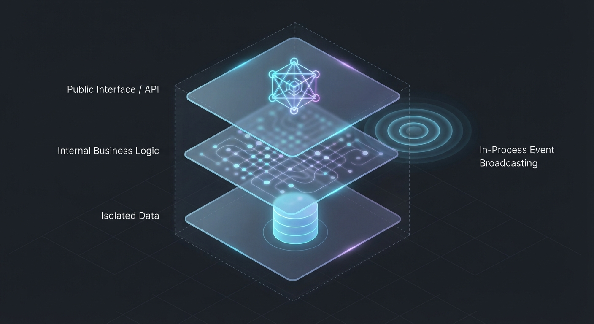
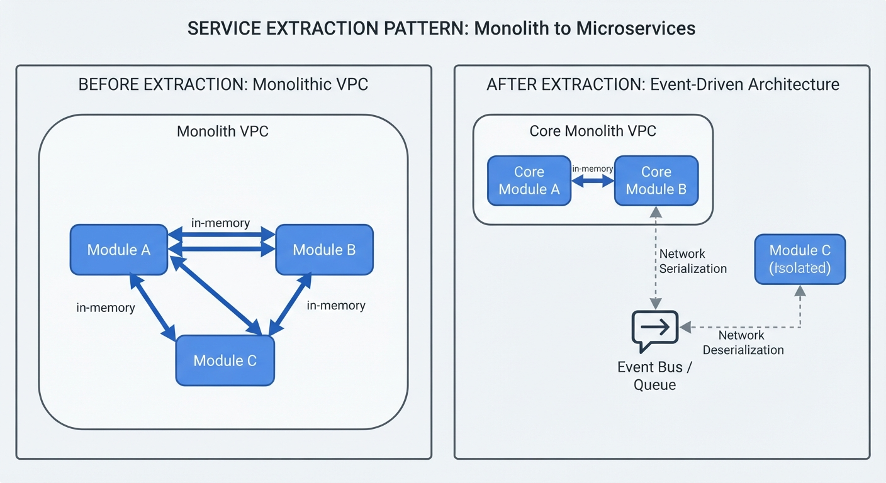
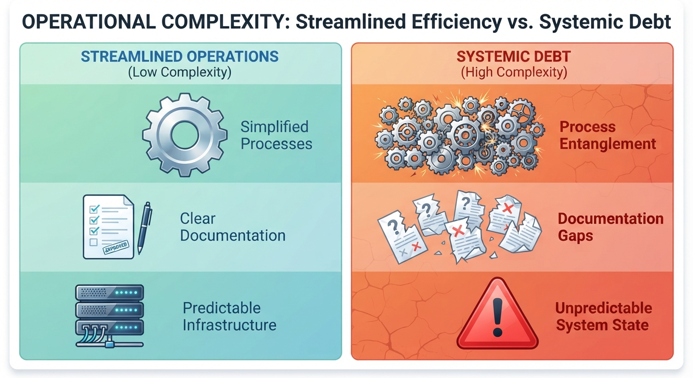

# Sanity at Scale (Part 1): An Architectural Decision Framework

When I was first learning to code, long before AI assistants were generating code for us, I stumbled across a paper from NASA's Jet Propulsion Laboratory called "The Power of Ten: Rules for Developing Safety-Critical Code." Just a couple of weeks ago, [Gerard Holzmann, the veteran who authored those rules, gave a retrospective talk](https://youtu.be/GRJtYwneG2Q?si=qwMECZhF2zsvEEjD) detailing how they were actually implemented. His core argument was striking: reliable software is designed, not just tested. To ensure software never failed in deep space, NASA didn't just rely on good intentions. They enforced a strict "zero-warning culture." Any static analysis warning broke the build. By ruthlessly automating checks that banned recursion and dynamic memory allocation after initialization, they minimized mission-ending bugs.

I remember watching that and wondering: How would I actually perform in an environment that rigorous?

The truth is, outside of aerospace, almost nobody writes code like that. Commercial software ecosystems are built on the dynamic memory and rapid iteration that NASA explicitly bans. We optimize for developer velocity and quick recovery, not mathematical perfection. You don't have to look far into enterprise engineering blogs to see why: [Stack Overflow famously scales to massive global traffic on a monolithic architecture](https://nickcraver.com/blog/2016/02/17/stack-overflow-the-architecture-2016-edition/) by deliberate constraint, and [Shopify deliberately stayed on their monolithic Rails app long past the point where conventional wisdom said to decompose](https://shopify.engineering/deconstructing-monolith-designing-software-maximizes-developer-productivity) — because shipping features faster than competitors was a matter of survival.

Over the years of building backend systems, from those early experiments to serving real production traffic, I realized that business realities always intervene. We take on technical debt to hit deadlines. We move fast. We compromise.

I’ve worked across many different ecosystems to align with those business realities. I would reach for Flask or FastAPI for lightweight APIs, lean on Django’s depth for complex, data-heavy apps, write Gin in Go when I need raw concurrency, and use NestJS to enforce strict modularity in sprawling codebases.

I deliberately switch stacks to fit the exact problem space. But regardless of whether I am writing Python, Go, or TypeScript, I’ve noticed my architectural default almost always settles in the same place to keep the chaos in check: the modular monolith.

This isn't a philosophical crusade against microservices. It's just survival. Unless you have an infinite engineering budget, you probably don't have the time to manage network calls, event brokers, and complex deployment topologies when a single process can do the same job. You want the deployment simplicity of a single app, but the organizational sanity of strict boundaries.

We've all seen the trend where teams are told to split their domains into separate repos and introduce network boundaries from day one to "build for scale." But in practice, that usually introduces network latency, tracing nightmares, and deployment headaches long before your actual traffic justifies it.

The problem isn't distributed systems themselves. It's paying the operational cost before you've demonstrated you actually need the benefits.

## The Distributed Trade-Off

In the Second Edition of Martin Kleppmann’s seminal book, Designing Data-Intensive Applications (DDIA), Chapter 1 opens with a quote from economist Thomas Sowell that serves as a stark reminder for engineers: "There are no solutions; there are only trade-offs."

Distributing a system doesn't eliminate complexity — it relocates it. Coupling that lived inside a function call now lives in a network protocol, a retry policy, and an eventual consistency model. The operational cost is real from day one. The scaling benefit is theoretical until your traffic proves otherwise.

We often assume that to achieve massive scale, we have to physically break our codebases apart, treating microservices as the default path to achieving the holy trinity of software engineering: Reliability, Scalability, and Maintainability. But as many teams have learned the hard way, true scalability comes from the independence of units of work—not premature distribution. If you actually measure a system against those goals, premature distribution often sabotages your architecture:

- **Maintainability is destroyed** because you replaced a single deployment pipeline with a sprawling web of interdependent releases and cross-repo coordination.
- **Reliability plummets** because you replaced instantaneous, guaranteed in-memory function calls with fragile network hops, partial failures, and complex retry logic.
- **Scalability is the only theoretical gain**—but most teams never reach the traffic volume required to justify the massive hits they took to reliability and maintainability.

The well-structured modular monolith is the ultimate balancing act of this trade-off. By enforcing strict domain boundaries within a single process, we retain the maintainability of cleanly isolated logic while deferring the sheer complexity of a distributed system until it is practically required.

## Architecture as Organizational Leverage

As companies grow, the measure of an engineering leader shifts from technical depth to leverage — how much the team ships per unit of coordination (a frame I picked up from Adam Horner's CTO Basecamp programme). Premature microservices destroy that leverage: instead of shipping routinely, your team drowns in cross-repo coordination and cascading failures. Architecture is a leadership decision, not just a technical one.

This is exactly where premature microservices sabotage engineering leadership. When you adopt a distributed system before you actually need one, you violate the core process mandate: turning chaotic delivery into disciplined execution. You end up reacting to infrastructure instead of leading the business.

The modular monolith is the architectural embodiment of this leadership lesson. It gives your team the structure to take ownership and deliver without bottlenecks, providing the organizational leverage of clean boundaries without the over-engineered operational tax.

## Scaling by Replication, Not Decomposition

A pervasive myth in modern software engineering is that scalability inherently requires decomposition. We assume that to handle massive scale, we must physically split our code into tiny, independent microservices. But true scalability comes from the independence of units of work, not the physical decomposition of the codebase.

By now, the [breakdown by Akhil Sharma of Amazon Prime Video’s architectural pivot](https://youtu.be/2QdgjQrxxRA?si=fOEymaDJGJOXzLv6) has been cited in nearly every modular monolith post since 2023. It's worth repeating not for novelty but because the lesson keeps getting ignored.

To process a video stream, individual frames had to cross network boundaries between services. This meant serialization, network transfer, deserialization, and orchestration at every single step. They had accidentally placed a service boundary on the "busiest path" of their system. The result? It cost them significantly more time and money just to move the data than it did to actually process it.

I've seen a smaller version of this in an AWS consulting engagement — two Lambda functions calling each other for every event in a processing pipeline, where inter-service network transfer costs were quietly dwarfing the actual compute costs.

Amazon ultimately solved this by consolidating those distributed components back into a single process—a monolith. They didn't achieve their massive scale by breaking the code apart; they scaled by running thousands of replicated copies of that monolithic process. They scaled by replication.

This provides a brutal but essential heuristic for your own architecture, which we can call the **Boundaries Rule**: For every proposed service boundary, ask yourself, "How much data crosses it, and how often?"

If the data volume is high and the frequency is constant, placing a distributed network boundary there will sabotage your system. Amazon’s transition wasn't a rejection of the concept of microservices; it was a rejection of unnecessary boundaries that provided zero organizational benefit but imposed a massive operational tax.

## The AI-Assisted Spaghetti Trap

In theory, keeping code domains decoupled to avoid unnecessary boundaries is supposed to be common knowledge. Every senior engineer knows you shouldn't tightly couple the billing logic to the user profile logic. But in the trenches, teams overlook these fundamentals every single day.

When an AI agent is asked to fix a bug in the billing service, it takes the path of least resistance. It doesn't know your architectural intent. It will write `from identity.models import User` directly inside `billing/service.py` — because it compiles, the test passes, and the task is done. In a codebase without enforced boundaries, that import sits quietly until six months later when changing the user schema breaks checkout.

This is exactly why good intentions aren't enough, and why the following constraints must be automated.

## The Three Pillars of Modularity

For a modular monolith to actually work, there are three non-negotiable constraints. Without them, you are just building a Big Ball of Mud:

### 1. Strict Domain Boundaries
Code executing within one domain is strictly prohibited from directly accessing or mutating the internal logic of another domain.
- **Violation:** `billing/service.py` imports `from identity.models import User` to check account status.
- **Correct:** `billing/service.py` calls `identity.interface.get_account_status(user_id)` — it knows nothing about how identity stores its data.

### 2. In-Process Communication
Domains communicate exclusively via an internal memory bus or rigorously defined interface contracts, thereby eliminating network hops and their associated points of failure.
- **Violation:** The billing module makes an HTTP call to `http://localhost:3001/identity/user`.
- **Correct:** It publishes a `PaymentInitiated` event to an internal memory bus. The identity module listens and reacts.

### 3. Rigorous Data Isolation
Each module maintains strict ownership over its respective data structures. Shared database tables and cross-domain SQL joins are entirely precluded.
- **Violation:** `SELECT u.email, b.amount FROM users u JOIN billing_records b ON u.id = b.user_id`
- **Correct:** The billing module stores only `user_id`. If it needs an email, it requests it through the identity interface. It never joins across domain tables.

## The Architecture Spectrum

To make this practical, we have to stop treating "monolith" and "microservices" as binary choices. Architecture is a progression. Think of it like this:

- **The Big Ball of Mud:** A single application where everything is tangled. The login logic can directly query the billing tables. Changing one thing breaks another. This is what most people picture when they hear "monolith," and it's exactly what we are trying to avoid.
- **The Modular Monolith:** A single deployable process, but the internal domains are treated like completely independent apps. There is zero network latency because it all runs in memory, but the code boundaries are strict.
- **Selective Extraction:** You have a modular monolith, but you've carved out one or two specific modules and put them on their own servers. The rest of the application remains a monolith. This is usually triggered by a specific, isolated hardware need (like moving a machine learning module to a GPU-optimized instance) or moving a heavily utilized background worker pool to separate compute nodes so it doesn't starve the main web API of resources.
- **The Distributed System:** The application is completely broken up into separate processes talking over a network. You get physical isolation, but you pay for it with network latency, partial failures, and complex deployments.

For most engineering teams, the goal should be to build a Modular Monolith and stay there as long as physically possible.

## Designing for Extractability

If you design your monolith with strict boundaries from day one, you build every module as if you might need to move it to its own server tomorrow.

When you do that, you realize you don't actually need to extract. You achieve the clean organizational boundaries of a microservice while retaining the massive operational discount of a single deployable unit.

When evaluating your next architectural move, run through this decision tree before adopting a distributed system:

- Is the problem caused by code coupling? → Fix the module boundary.
- Is the problem caused by traffic volume? → Scale the monolith horizontally.
- Is the problem caused by infrastructure asymmetry? → Consider extraction.
- Is the problem caused by deployment independence? → Consider extraction.
- Is the problem caused by compliance/security isolation? → Consider extraction.
- Is the problem caused by genuine team ownership boundaries? → Consider extraction.

If the answer to the last four questions is no, do not pay the distributed-systems tax yet.

## When Should You Actually Extract?

"We have more users now" is not a reason to extract a microservice. If you just have more traffic, placing a load balancer in front of your monolith and running ten copies of it is usually enough.

I only take on the pain of a distributed system when I hit a hard physical or organizational wall. Across the different stacks I've worked in, legitimate extraction is typically catalyzed by one of these five specific asymmetries:

### 1. Scaling Asymmetry
**Concept:** One domain possesses fundamentally distinct compute requirements.  
**Real-World Example:** You build an AI-Orchestrator into your app. The standard CRUD web application runs fine on cheap CPUs, but the AI module requires expensive GPU instances for local inference.  
**The Solution:** Extract only the AI module to a GPU-backed service.

### 2. Reliability Asymmetry
**Concept:** A specific component requires stringent failure isolation to protect the broader system.  
**Real-World Example:** Your application generates heavy PDF reports.  
**The Solution:** Extract the reporting engine into a separate background worker service so its crashes don't affect user web traffic.

### 3. Deployment Asymmetry
**Concept:** One domain necessitates independent releases at a materially different cadence than the core application.  
**Real-World Example:** Your core banking ledger updates once a month after strict QA, but your user-facing mobile app API needs to deploy new UI features twice a day.  
**The Solution:** Extract the mobile API gateway from the core ledger.

### 4. Compliance Asymmetry
**Concept:** A component requires an isolated regulatory boundary.  
**Real-World Example:** Your e-commerce app starts handling raw credit card data to achieve PCI compliance.  
**The Solution:** Extract the payment tokenizer into a tiny, hyper-secure microservice to shrink the compliance blast radius.

### 5. Organizational Asymmetry
**Concept:** A domain is managed by a genuinely independent engineering team requiring complete autonomous ownership.  
**Real-World Example:** A massive company acquires a smaller startup and integrates their product.  
**The Solution:** Let them operate their domain as an extracted, sovereign service communicating via an API contract.

## The Distributed Systems Tax

Before you pull the trigger and move a module to its own repository, you have to look at the bill. Moving code across a network changes your day-to-day engineering reality.

### The Distributed Systems Tax Comparison

| Aspect | Modular Monolith | Fully Distributed System |
|--------|------------------|---------------------------|
| **Deployments** | Single pipeline, single version. Coordination overhead is zero. | Multiple independent pipelines. Requires cross-team version coordination and release planning. |
| **Debugging failures** | Simple structured logging with full call stacks. Always know exactly where something broke. | Requires distributed tracing, service maps, and complex observability tooling to trace failures across network hops. |
| **Data access** | Sub-millisecond in-memory function calls. No serialization overhead. | Network calls with 10-100ms latency. Must handle JSON/protobuf serialization, retries, and timeouts. |
| **Failure modes** | Atomic failure state: the application is either healthy or down. Partial failures are extremely rare. | Partial failures are commonplace. You must implement circuit breakers, retry logic, and graceful degradation. |
| **Operational load** | Single set of alerts routed directly to the module owner. On-call rotations are simple. | Cascading alerts across dozens of services. Requires dedicated SRE teams to manage on-call rotations and incident response. |

## Maximizing Options, Minimizing Tax

You only take on the operational complexity of a distributed system after the physical scaling profile, deployment cadence, or compliance requirements of your business practically forces you to.

Until then, keep your code boundaries strict, keep your database tables isolated, and keep your deployments simple. Maximize your architectural options, and minimize your operational tax.

I asked myself years ago how I would perform under NASA's strict "Power of Ten" constraints. The answer, practically speaking, is that I don't have to. We aren't sending code to Mars. But by adopting just a fraction of Holzmann's philosophy—specifically, relying on rigorous automation and treating boundary violations with a "zero-warning" mentality that instantly breaks the build—we can design systems that scale beautifully right here on Earth.

In Part 2 of this series, we will look at the actual code. We'll cover the exact patterns you need to enforce these boundaries in modern backend frameworks.